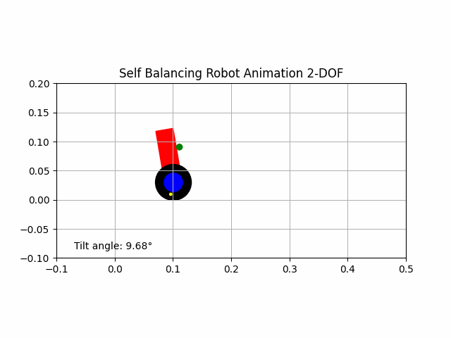
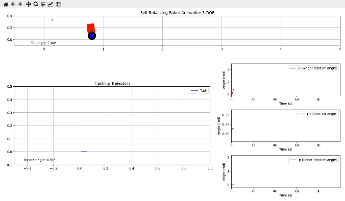
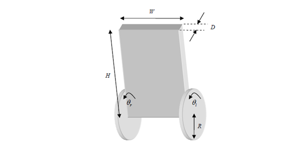
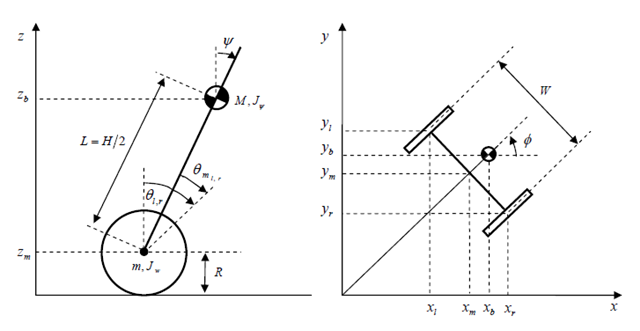
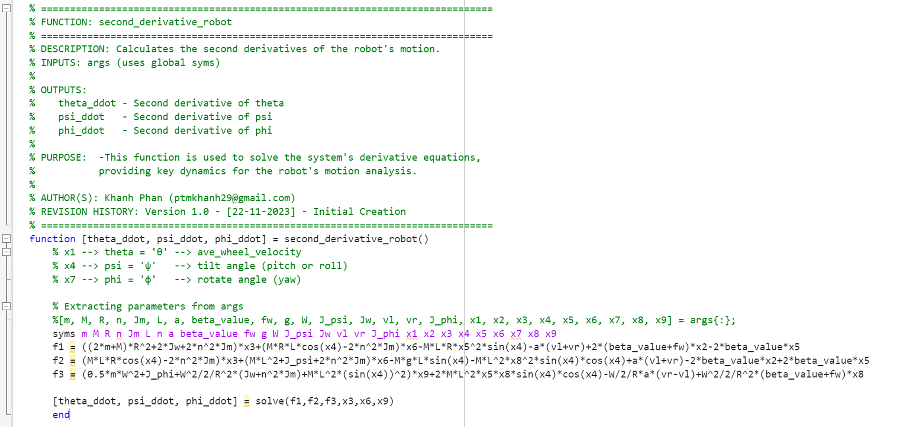
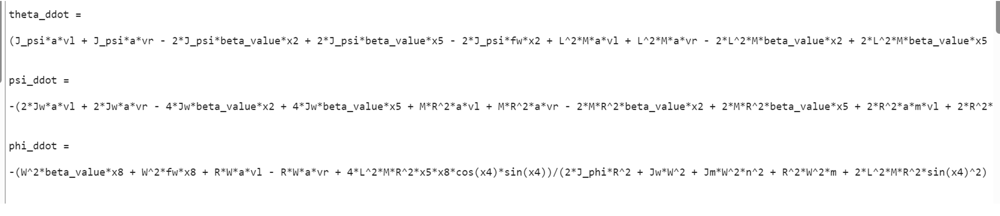

# Control Two Wheeled Self Balancing Robot using LQR controller

## 1. Simulation Results

### 2D Simulation

In this model, the robot's state is represented by the `position` and `velocity` of the center of mass (COM) and the angular velocities of the wheels



### 3D Simulation

In this model, the robot's state is represented by the `position, velocity, and angular velocities (roll, pitch, and yaw)` of the center of mass (COM) and the angular velocities of the wheels



---------------------------------
## 2. Dynamic equations

In the repository, I am only presenting the equations for the `3D model`.

### Modeling Robot






| Symbol                | Unit   | Description                        |
|-----------------------|--------|------------------------------------|
| $` \theta_{(l,r)} `$    | Rad    | Angle of the left and right wheels |
| ψ                     | Rad    | Tilt angle of the robot body       |
| ϕ                     | Rad    | Rotation angle of the robot        |


The dynamics of the two wheeled self-balancing robot can be described by the following system of differential equations:

### Parameters Robot

| Symbol       | Unit      | Description                                           |
|--------------|-----------|-------------------------------------------------------|
| $` m `$      | Kg        | Mass of the wheel                                     |
| $` M `$      | Kg        | Mass of the robot                                     |
| $` R `$      | M         | Radius of the wheel                                   |
| $` W `$      | M         | Width of the robot                                    |
| $` D `$      | M         | Length of the robot                                   |
| $` H `$      | M         | Height of the robot                                   |
| $` L `$      | M         | Distance from the robot's center of mass to the axle  |
| $` f_w `$    |           | Friction coefficient between the wheel and the plane  |
| $` f_m `$    |           | Friction coefficient between the robot and the DC motor |
| $` I_m `$    | kg·m²     | Moment of inertia of the DC motor                     |
| $` R_m `$    | Ohm       | Resistance of the DC motor                            |
| $` K_b `$    | V·sec/rad | EMF coefficient of the DC motor                       |
| $` K_t `$    | Nm/A      | Torque coefficient of the DC motor                    |
| $` N `$      |           | Gear reduction ratio                                  |
| $` G `$      | m/s²      | Gravitational acceleration                            |
| $` \theta `$ | Rad       | Average angle of the left and right wheels            |
| $` \theta_{(l,r)} `$ | Rad | Angle of the left and right wheels                   |
| $` \psi `$   | Rad       | Tilt angle of the robot body                          |
| $` \phi `$   | Rad       | Rotation angle of the robot                           |
| $` x_l, y_l, z_l `$ | M   | Coordinates of the left wheel                        |
| $` x_r, y_r, z_r `$ | M   | Coordinates of the right wheel                       |
| $` x_m, y_m, z_m `$ | M   | Average coordinates                                   |
| $` F_\theta, F_\psi, F_\phi `$ | Nm  | Torque generated in different directions    |
| $` F_{(l,r)} `$ | Nm      | Torque generated by the left and right motors         |
| $` i_l, i_r `$ | A        | Current through the left and right motors             |
| $` v_l, v_r `$ | V        | Voltage across the left and right motors              |              |


### Dynamic equations

Apply the Euler-Lagrange equations to the robot's dynamics:

```math
\frac{d}{dt} \left( \frac{\partial L}{\partial \dot{q}_i} \right) - \frac{\partial L}{\partial \theta_k} = F_k
```

Where

>- $T$: The sum of the kinetic energy components of the system.
>- $V$: The sum of the potential energy components of the system.
>- $L_{\text{lagrange}} = T - V$: The Lagrangian multiplier.
>- $q_i$: A generalized coordinate describing one of the degrees of freedom in the system.
>- $F_k$: The total external force acting on the system corresponding to the generalized coordinates $q_i$.
>- For the 3-degree-of-freedom model, there are three generalized coordinates: $q_1 = x$ (The horizontal motion); $q_2 = \theta$ (The tilt angle); $q_3 = \psi$ (The rotation angle of the robot body).

Assuming at time $t = 0$, the robot moves in the positive direction of the x-axis. The dynamic equations describing the motion of the robot are as follows:
```math
(2m + M)R^2 + 2J_w + 2n^2 J_m) \ddot{\theta} + (MLR \cos \psi - 2n^2 J_m) \ddot{\psi} - MLR \psi^2 \sin \psi = \alpha(v_l + v_r) - 2(\beta + f_w) \dot{\theta} + 2\beta \dot{\psi} \quad (5.1)
```

```math
(MLR \cos \psi - 2n^2 J_m) \ddot{\theta} + (ML^2 + J_{\psi} + 2n^2 J_m) \ddot{\psi} - MgL \sin \psi - ML^2 \dot{\phi}^2 \sin \psi \cos \psi = -\alpha(v_l + v_r) + 2\beta \dot{\theta} - 2\beta \dot{\psi} \quad (5.2)
```

```math
\left(\frac{1}{2} mW^2 + J_{\phi} + \frac{W^2}{2R^2} (J_w + n^2 J_m) + ML^2 \sin^2 \psi\right) \ddot{\phi}^2 + 2ML^2 \dot{\psi} \dot{\phi} \sin \psi \cos \psi = \frac{W}{2R} \alpha(v_r - v_l) - \frac{W^2}{2R^2} (\beta + f_w) \dot{\phi} \quad (5.3)
```

We need to reformulate these equations as follows:
```math
\left\{
\begin{array}{l}
\dot{\theta} = f_1(\dot{\theta}) \\
\ddot{\theta} = f_2(\theta, \psi, \phi, \dot{\theta}, \dot{\psi}, \dot{\phi}, v_r, v_l) \\
\dot{\psi} = f_3(\dot{\psi}) \\
\ddot{\psi} = f_4(\theta, \psi, \phi, \dot{\theta}, \dot{\psi}, \dot{\phi}, v_r, v_l) \\
\dot{\phi} = f_5(\dot{\phi}) \\
\ddot{\phi} = f_6(\theta, \psi, \phi, \dot{\theta}, \dot{\psi}, \dot{\phi}, v_r, v_l)
\end{array}
\right\}
```

Solve equations (5.1), (5.2), and (5.3) using MATLAB software and the `solve` function.



Result calculation



### Linearize the motion equations 

Apply the state-space function to the robot system as follows:

```math
\dot{x} = A_0 x + B_0 u
```

Where $u$ is defined as:
```math
u = \begin{bmatrix} v_l \\ v_r \end{bmatrix}^\top
```

and $x$ is defined as:

```math
x = \begin{bmatrix} \theta \\ \dot{\theta} \\ \psi \\ \dot{\psi} \\ \phi \\ \dot{\phi} \end{bmatrix}^\top
```

Linearizing the robot at the equilibrium point (where all initial state variables are zero) allows for accurate determination of the matrices $A_0$ and $B_0$ for the equilibrium condition, where the robot is assumed to be stable.

The working point chosen to proceed with the linearization of the robot to a linear form $\dot{X} = A_0 X + B_0 U$ is as follows:
Working point:
```math
u_0 = \begin{bmatrix} 0 \\ 0 \end{bmatrix}^\top
```
and
```math
x_0 = \begin{bmatrix} 0 \\ 0 \\ 0 \\ 0 \\ 0 \\ 0 \end{bmatrix}^\top
```

$A_0$ is given by:
```math
A_0 = \begin{bmatrix}
0 & 1 & 0 & 0 & 0 & 0 \\
\left. \frac{\partial f_2}{\partial \theta} \right|_{x=x_0, u=u_0} & \left. \frac{\partial f_2}{\partial \dot{\theta}} \right|_{x=x_0, u=u_0} & \left. \frac{\partial f_2}{\partial \psi} \right|_{x=x_0, u=u_0} & \left. \frac{\partial f_2}{\partial \dot{\psi}} \right|_{x=x_0, u=u_0} & \left. \frac{\partial f_2}{\partial \phi} \right|_{x=x_0, u=u_0} & \left. \frac{\partial f_2}{\partial \dot{\phi}} \right|_{x=x_0, u=u_0} \\
0 & 0 & 0 & 1 & 0 & 0 \\
\left. \frac{\partial f_4}{\partial \theta} \right|_{x=x_0, u=u_0} & \left. \frac{\partial f_4}{\partial \dot{\theta}} \right|_{x=x_0, u=u_0} & \left. \frac{\partial f_4}{\partial \psi} \right|_{x=x_0, u=u_0} & \left. \frac{\partial f_4}{\partial \dot{\psi}} \right|_{x=x_0, u=u_0} & \left. \frac{\partial f_4}{\partial \phi} \right|_{x=x_0, u=u_0} & \left. \frac{\partial f_4}{\partial \dot{\phi}} \right|_{x=x_0, u=u_0} \\
0 & 0 & 0 & 0 & 0 & 1 \\
\left. \frac{\partial f_6}{\partial \theta} \right|_{x=x_0, u=u_0} & \left. \frac{\partial f_6}{\partial \dot{\theta}} \right|_{x=x_0, u=u_0} & \left. \frac{\partial f_6}{\partial \psi} \right|_{x=x_0, u=u_0} & \left. \frac{\partial f_6}{\partial \dot{\psi}} \right|_{x=x_0, u=u_0} & \left. \frac{\partial f_6}{\partial \phi} \right|_{x=x_0, u=u_0} & \left. \frac{\partial f_6}{\partial \dot{\phi}} \right|_{x=x_0, u=u_0}
\end{bmatrix}
```

$B_0$ is given by:
```math
B_0 = \begin{bmatrix}
0 & 0 \\
\left. \frac{\partial f_2}{\partial v_l} \right|_{x=x_0, u=u_0} & \left. \frac{\partial f_2}{\partial v_r} \right|_{x=x_0, u=u_0} \\
0 & 0 \\
\left. \frac{\partial f_4}{\partial v_l} \right|_{x=x_0, u=u_0} & \left. \frac{\partial f_4}{\partial v_r} \right|_{x=x_0, u=u_0} \\
0 & 0 \\
\left. \frac{\partial f_6}{\partial v_l} \right|_{x=x_0, u=u_0} & \left. \frac{\partial f_6}{\partial v_r} \right|_{x=x_0, u=u_0}
\end{bmatrix}
```

Using MATLAB to solve the system equations:
The final state-space function equation will take the form:
```math
\dot{x} = A_0 x + B_0 u
```
```math
\begin{bmatrix} \dot{\theta} \\ \ddot{\theta} \\ \dot{\psi} \\ \ddot{\psi} \\ \dot{\phi} \\ \ddot{\phi} \end{bmatrix} = \begin{bmatrix} 0 & 1 & 0 & 0 & 0 & 0 \\ 0 & a_{22} & a_{23} & a_{24} & 0 & 0 \\ 0 & 0 & 0 & 1 & 0 & 0 \\ 0 & a_{42} & a_{43} & a_{44} & 0 & 0 \\ 0 & 0 & 0 & 0 & 0 & 1 \\ 0 & 0 & 0 & 0 & 0 & a_{66} \end{bmatrix} \begin{bmatrix} \theta \\ \dot{\theta} \\ \psi \\ \dot{\psi} \\ \phi \\ \dot{\phi} \end{bmatrix} + \begin{bmatrix} 0 & 0 \\ b_{21} & b_{22} \\ 0 & 0 \\ b_{41} & b_{42} \\ 0 & 0 \\ b_{61} & b_{62} \end{bmatrix} \begin{bmatrix} v_l \\ v_r \end{bmatrix} \quad (5.4)
```
Elements of both matrices will be calculated by MATLAB.